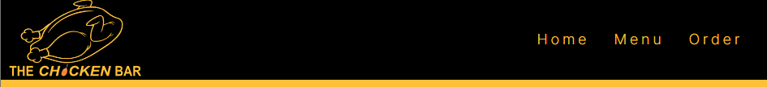
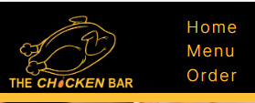
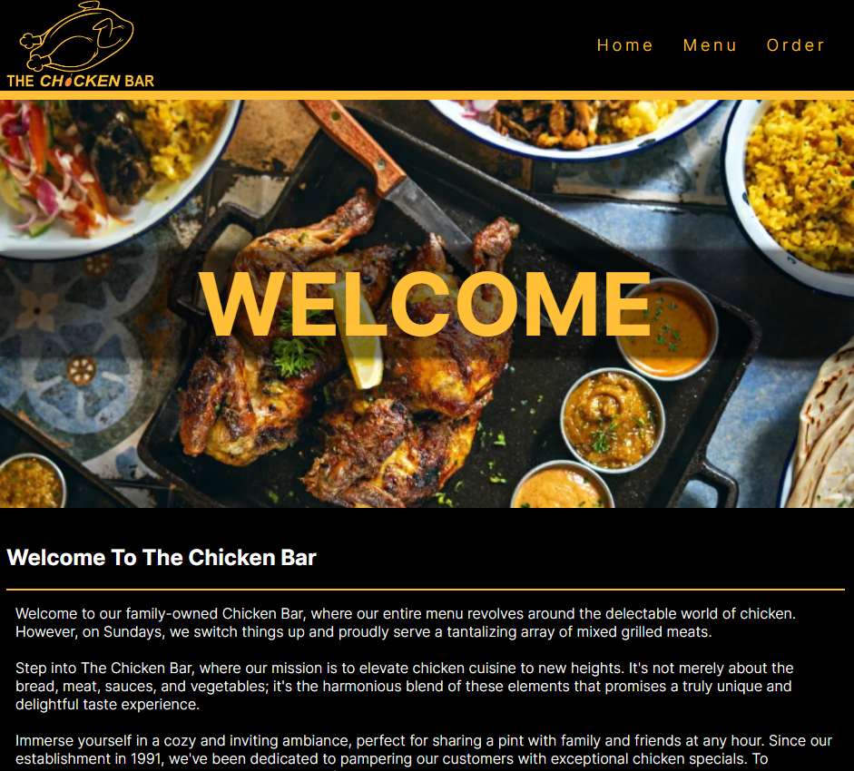

 

# The Chicken Bar 

## Introduction

Welcome to The Chicken Bar website, where our entire menu (Monday through Friday) is dedicated to the delectable world of chicken. However, on Sundays, we switch things up and proudly serve a tantalizing array of mixed grilled meats. 

This site is specifically targeted toward chicken and meat lovers, who will find a unique and special dish on offer every day. 

They can order their favorite dishes online and pick them up within 15 minutes of placing their order.

The live link can be found here - [The Chicken Bar](https://amirshkolnik.github.io/TheChickenBar/)

## Project Goals

Our goal is not just to create another website. 

We want to elevate the online chicken cuisine experience to new heights. It's not just about the bread, chicken, sauces, and vegetables. It's the perfect blend of these elements that promises a truly unique and delightful taste experience.

We want our visitors to be able to almost smell and taste our dishes while browsing our site. 

When you're hungry, you want food right away, ordering food online should be easy, quick, and secure.

## Target Audience

- who appreciate high-quality, flavorful meat dishes.

- Time-strapped families seeking practical, healthy, and budget-friendly meal solutions for quick lunches or dinners mid-week or on weekend outings.

- Couples seeking a romantic ambiance for a special lunch or dinner.

- Busy professionals on the go who desire a quick and healthy lunch option during their limited lunch break.

## Features and User Experience

### Existing Features

- __Header - Navigation Bar and clickable logo__

  - The header is made up of two parts: a clickable logo on the left and a navigation bar on the right.

  - The header is present throughout the entire website on every page. Visitors can easily navigate from page to page.

  - The header is responsive and on smaller screens the logo will get smaller and the navigation bar will be presented vertically.

### Desktop:

### Mobile:

- __Home Page - Welcome__

  - 
  - 

-------------------------

## Site Owner Goals 

## User Stories
- ### First time user
  

- ### Returning User
  
- ### Frequent User
  

## Design

### Imagery

### Colours
 

### Fonts

## Wireframes

## Features
- ### Navigation

    - The fully responsive navigation bar includes links to the Home, Menu and Order pages. 

- ### The Landing Page Image

 

- ### About Section

    

  
- ### Order Form Section

 

- ### Visit Us Section

 

- ### Map Section

 

- ### Footer

### Features Left to Implement
- Burger button for the mobile nav bar.

## Testing

### Validator Testing
- #### HTML
    - No errors were returned when passing through the official W3C Markup Validator
        - [W3C Validator Results](https://validator.w3.org/nu/?doc=https%3A%2F%2Famirshkolnik.github.io%2FTheChickenBar%2F)
        https://validator.w3.org/nu/?doc=https%3A%2F%2Famirshkolnik.github.io%2FTheChickenBar%2Fmenu.html
        https://validator.w3.org/nu/?doc=https%3A%2F%2Famirshkolnik.github.io%2FTheChickenBar%2Forder.html
        https://validator.w3.org/nu/?doc=https%3A%2F%2Famirshkolnik.github.io%2FTheChickenBar%2Fthank-you.html

        - 

- #### CSS
    - No errors were found when passing through the official W3C CSS Validator 
        - [W3C CSS Validator Results](https://jigsaw.w3.org/css-validator/validator?uri=https%3A%2F%2Famirshkolnik.github.io%2FTheChickenBar%2Fassets%2Fcss%2Fstyle.css&profile=css3svg&usermedium=all&warning=1&vextwarning=&lang=en)

       
- #### Accessibility 
    - The site achieved a Lighthouse accessibility score of 100% which confirms that the colours and fonts chosen are easy to read and accessible

### Form Testing
- The form has been tested to ensure it would not submit without the required input fields being filled in (full name and email address).

### Links Testing
- All navigation links were tested manually to ensure the user is directed to the correct section of the website.
- Social Media links in the footer of each page were tested manually to ensure they direct the user to the correct page and open in a new tab. 

### Browser Testing
- I checked the website on Google Chrome, Firefox, Microsoft Edge, and Safari browsers, and everything was fine with no problems.
    
### Device Testing
- I checked and tested the website on different devices like Desktop, Laptop, Samsung S21, and 14A, iPhone 12 PRO, and 14 PRO to make sure it works well on different screen sizes.

The website worked as I wanted it to. I also used Chrome developer tools on all the devices to test the responsive design, and it stayed intact for all sizes.

- I also tried the website on the following websites to test its responsiveness:

    - [Responsinator](http://www.responsinator.com/?url=https%3A%2F%2Famirshkolnik.github.io%2FTheChickenBar%2F)
    - [Am I Responsive](https://ui.dev/amiresponsive?url=https://amirshkolnik.github.io/TheChickenBar/)

### User Experience - Friends and Family User Testing
Friends and family were asked to check the site and documents for any problems or issues.

#### Order Form

 - When asking for phone numbers on the order form, some testers found the 123-45-678 format confusing. They couldn't enter "-" symbols on their mobile devices. So, I changed the format to 1112223333, which is easier to enter on both mobile and desktop devices.

#### Home and Thank You Page Text On Large Screen

 - When I initially implemented the text sections for the home and the thank you pages, I set them with a width of 100%. All testers found the result annoying because the text was taking up too much space and testers had difficulty reading and enjoying the site. I changed the width to 70%.

 #### Responsive Map

I encountered an issue where adding Google Maps using an iframe was not responsive on many screens. After placing the iframe inside two divs and modifying the size using media queries in the CSS file, I was able to make the map size responsive.

### Fixed Bugs

#### Using Class Instead of ID

When I first made my menu page, I used the same ID for all the dishes. This caused an error because the ID had to be unique. After learning the difference between IDs and classes, I fixed the error.

### Known Bugs

No, everything is working as it should.

## Technologies Used

### Languages
- HTML5
- CSS

### Frameworks - Libraries - Programs Used

- Affinity Photo - Photo Editing Program.
- [Am I Responsive](http://ami.responsivedesign.is/) - Used to verify responsiveness of website on different devices.
- [Responsinator](http://www.responsinator.com/) - Used to verify responsiveness of website on different devices.
- [Chrome Dev Tools](https://developer.chrome.com/docs/devtools/) - Used for overall development and tweaking, including testing responsiveness and performance.
- [Font Awesome](https://fontawesome.com/) - Used for Social Media icons in footer.
- [GitHub](https://github.com/) - Used for version control and hosting.
- [Google Fonts](https://fonts.google.com/) - Used to import and alter fonts on the page.
- [Convertio](https://convertio.co/) - Used to convert and compress images to reduce file size without a reduction in quality.
- [W3C](https://www.w3.org/) - Used for HTML & CSS Validation.

## Deployment

The project was deployed using GitHub pages. The steps to deploy using GitHub pages are:

1. Go to the repository on GitHub.com
2. Select 'Settings' near the top of the page.
3. Select 'Pages' from the menu bar on the left of the page.
4. Under 'Source' select the 'Branch' dropdown menu and select the main branch.
5. Once selected, click the 'Save'.
6. Deployment should be confirmed by a message on a green background saying "Your site is published at" followed by the web address.

The live link can be found here - [The Chicken Bar](https://amirshkolnik.github.io/TheChickenBar/)

## Credits

### Content
I got inspired for the template and design from the following websites:

- [Chick Demo](https://chik-demo.myshopify.com/)
- [Treatos Demo](https://preview.themeforest.net/item/treatos-authentic-restaurant-theme/full_screen_preview/25629199?_ga=2.149811830.1152558158.1704960033-426616010.1703934873)

I got inspired for the content and design from the following websites:

- [bb.9 Chicken](https://bbqchickenca.com/)
- [El Pollo Loco](https://www.elpolloloco.com/)
- [Wendy](https://www.wendys.com/en-uk/)
- [Galitos](https://galitoschicken.com/)
- [Mediterran](https://www.mediterraneanliving.com/grilled-turmeric-chicken/)

### Media
I used images, vectors, and illustrations from the following websites with thanks to the amazing photographers who created them.:

- [Pexels](https://www.pexels.com/)
    - Dee Dave - Home page - Hero Image
    - Oliver Sjöström - Guy Holding Chicken Burger
    - Karolina Grabowska - Home Page Closing Image - Chicken Plate
    - Lukas - Menu Page - Chicken Schnizel
    - HM Grand Central Hotel - Menu Page - Chicken Soup
    - Valeria Boltneva - Menu Page - Chicken Sandwich
    - Alena Shekhovtcova - Menu Page - Chicken Wings
    - Leonardo Luz - Menu Page - Chicken Nuggets
    - Christine Cleireny - Menu Page - Grilled Chicken Breast
    - ENESFİLM - Menu Page - Mix Grill
    - Valeriia Yevchinets - Order Page - Hero Image

- [Pixaby](https://pixaby.com/)
    - 13smok - Logo illustraion/vectors
    - Clker-Free-Vector-Images - Favicon
   
### Resources Used

- Code Institute Slack community
- [W3Schools](https://www.w3schools.com/)
- [Stack Overflow](https://stackoverflow.com/)

## Acknowledgments
My mentor, Antonio Rodriguez, for his support and guidance.

Thank you to the Code Institute Slack community for their quick responses and helpful feedback!