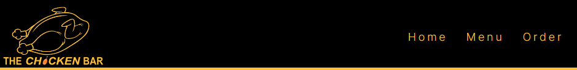

# The Chicken Bar 

## Introduction

The Chicken Bar website is designed to provide a quick and simple solution for hungry individuals. Dedicated to a crowd that loves and appreciates high-quality, flavorful chicken dishes, Chicken Bar offers a selection of 7 special daily menus.

The best part? Visitors can fill out a straightforward order form and pick up their meal within 15 minutes! Explore our easy-to-navigate site, choose your favorite, and get ready for a quick and delightful chicken experience!

The live link can be found here - [The Chicken Bar](https://amirshkolnik.github.io/TheChickenBar/)

## Project and Site Owner Goals

Our goal is not just to create another website. 

We want to elevate the online chicken cuisine experience to new heights. It's not just about the bread, chicken, sauces, and vegetables. It's the perfect blend of these elements that promises a truly unique and delightful taste experience.

We want our visitors to be able to almost smell and taste our dishes while browsing our site. 

When you're hungry, you want food right away, ordering food online should be easy, quick, and secure.

The entire menu revolves around the delectable world of chicken. However, on Sundays, we switch things up and proudly serve a tantalizing array of mixed grilled meats.

## Target Audience

- Hungry people who appreciate high-quality, flavorful chicken and meat dishes.

- Time-strapped families seeking practical, healthy, and budget-friendly meal solutions for quick lunches or dinners mid-week or on weekend outings.

- Couples seeking a romantic ambiance for a special lunch or dinner.

- Busy professionals on the go who desire a quick and healthy lunch option during their limited lunch break.

## User Stories

- ### First time user
  
  As a first-time user, I would like to know:
  
  - The types of food and prices offered by The Chicken Bar. 
  - I am curious about the location and the estimated cooking time for my dish. 
  - Additionally, I would like to understand whether I need to pick up my meal or if delivery is an option.
  - I hope to intuitively navigate the website and have a positive emotional experience.

- ### Returning User

  As a frequent user:

  - I want to easily place an order.
  - I want to see different exciting dishes. 
  - I want to enjoy extras and freebies, and feel special.

## Design

### Imagery

The Chicken Bar is full of colorful images showcasing grilled chicken and delicious chicken based dishes. It's like a visual menu of tasty options, making customers feel confident they'll find their perfect chicken dish.

### Colors

- The colour scheme of the website is yellow rgb(255, 192, 55), black and white. 

- Color influences consumers not only on the conscious level but also on the subconscious level. Color and food pairings can be especially powerful by leveraging the emotional connection to taste. Source - [Jenny David](https://jenndavid.com/)

### Fonts

- The main font used on the entire site is called 'Inter.' 
- Additionally, I have Sans Serif set up as a backup font. This way, if, for some reason, the main font doesn't load correctly on the site, Sans Serif will be used instead.

## Features

- ### Navigation

  - The header is made up of two parts: a clickable logo on the left and a navigation bar on the right.

  - The header is present throughout the entire website on every page. Visitors can easily navigate from page to page.

  - The header is responsive and on smaller screens the logo will get smaller and the navigation bar will be presented vertically.

### Desktop:

### Mobile:

### The Home / Welcome Page
  - The home page has an image with a welcoming headline. Right away, visitors feel like they're in the right place. This section gives users a clear visual idea of what the site is all about.

### The Menu Page

  - The menu page contains seven different kinds of dishes that the customer can choose from. They can select their favorite dish and click the order button, which will lead them to the order page where they can place an order.

    
### The Order Page

- At the order page, customers will find all the information they need about our chicken bar, such as opening hours, address, and even a map. 

- The main feature on this page is the order form. By using the order form, they can place an order. The form is designed so customers must fill in all necessary fields before they can place an order.

### The Thank You Page

- After filling out the order form, the customer will be forwarded to a thank you/confirmation page to ensure that their order has been received and will be ready within 15 minutes.

### Footer

- The footer contains our logo, contact information, and social media links. Clicking on them will open new tabs with the relevant social channels like Yotube, Instagram and Meta/Facebook.

### Features Left to Implement
- I want to replace all the main pictures with videos to make the user experience better.
- Make the order form simpler. Instead of typing what you want to order, you should be able to click and choose the number of meals from each dish.
- Burger button for the mobile nav bar.
- Adding prices
- Checkout and onsite payment methods.
- Adding a delivery section.

## Testing

### Validator Testing
- #### HTML
No errors were returned when passing through the official W3C Markup Validator see below or click the links to see the results for each page.
- Home Page - [W3C Validator Results](https://validator.w3.org/nu/?doc=https%3A%2F%2Famirshkolnik.github.io%2FTheChickenBar%2F)
- Menu Page - [W3C Validator Results - Menu Page](https://validator.w3.org/nu/?doc=https%3A%2F%2Famirshkolnik.github.io%2FTheChickenBar%2Fmenu.html)
- Order Page - [W3C Validator Results - Order Page](https://validator.w3.org/nu/?doc=https%3A%2F%2Famirshkolnik.github.io%2FTheChickenBar%2Forder.html)
- Thank You Page - [W3C Validator Results - Thank You Page](https://validator.w3.org/nu/?doc=https%3A%2F%2Famirshkolnik.github.io%2FTheChickenBar%2Fthank-you.html)

#### CSS

- No errors were found when passing through the official W3C CSS Validator, see below or click the link - [W3C CSS Validator Results](https://jigsaw.w3.org/css-validator/validator?uri=https%3A%2F%2Famirshkolnik.github.io%2FTheChickenBar%2Fassets%2Fcss%2Fstyle.css&profile=css3svg&usermedium=all&warning=1&vextwarning=&lang=en).

##### W3C CSS Validator Results

#### Accessibility 

- The site achieved a Lighthouse accessibility score of 100% for mobile and pc which confirms that the colors and fonts chosen are easy to read and accessible.

##### Lighthouse Score For PC

##### Lighthouse Score For Mobile

### Form Testing
- I checked the form to make sure you can't send it unless you fill in the necessary information like your name, email address, phone number and "What Do You Wish To Order?".

### Links Testing
- I checked all the navigation links to make sure they take the user to the right parts of the website.
- I manually tested the links on the menu page to ensure users go to the order form correctly.
- I tested the order form to make sure that after submitting, users are taken to the thank you page.
- I also inspected the Social Media links at the bottom of each page to make sure they take the user to the right page and open in a new tab.

### Browser Testing
- I checked the website on Google Chrome, Firefox, Microsoft Edge, and Safari browsers, and everything was fine with no problems.
    
### Device Testing
- I checked and tested the website on different devices like Desktop, Laptop, Samsung S21, and 14A, iPhone 12 PRO, and 14 PRO to make sure it works well on different screen sizes.

The website worked as I wanted it to. I also used Chrome developer tools on all the devices to test the responsive design, and it stayed intact for all sizes.

- I also tried the website on the following websites to test its responsiveness:

    - [Responsinator](http://www.responsinator.com/?url=https%3A%2F%2Famirshkolnik.github.io%2FTheChickenBar%2F)
    - [Am I Responsive](https://ui.dev/amiresponsive?url=https://amirshkolnik.github.io/TheChickenBar/)

### User Experience - Friends and Family User Testing
Friends and family were asked to check the site and documents for any problems or issues.

#### Header
 
 - Adding a padding-top of 15px to the header section was necessary. On some devices, such as iPhone 6, 8, and Pixel 7, the logo was very close to the top and didn't look good.

 Before The Change:

 

 After The Change:

#### Order Form

 - When asking for phone numbers on the order form, some testers found the 123-45-678 format confusing. They couldn't enter "-" symbols on their mobile devices. So, I changed the format to 1112223333, which is easier to enter on both mobile and desktop devices.

  Before The Change:

  

  After The Change:

  

#### Home and Thank You Page Text On Large Screen

 - When I initially implemented the text sections for the home and the thank you pages, I set them with a width of 100%. All testers found the result annoying because the text was taking up too much space and testers had difficulty reading and enjoying the site. I changed the width to 70%.

 #### Responsive Map

I encountered an issue where adding Google Maps using an iframe was not responsive on many screens. After placing the iframe inside two divs and modifying the size using media queries in the CSS file, I was able to make the map size responsive.

### Fixed Bugs

#### Using Class Instead of ID

When I first made my menu page, I used the same ID for all the dishes. This caused an error because the ID had to be unique. After learning the difference between IDs and classes, I fixed the error.

### Known Bugs

No, everything is working as it should.

## Technologies Used

### Languages
- HTML5
- CSS

### Frameworks - Libraries - Programs Used

- Affinity Photo - Photo Editing Program.
- [Am I Responsive](http://ami.responsivedesign.is/) - Used to verify responsiveness of website on different devices.
- [Responsinator](http://www.responsinator.com/) - Used to verify responsiveness of website on different devices.
- [Chrome Dev Tools](https://developer.chrome.com/docs/devtools/) - Used for overall development and tweaking, including testing responsiveness and performance.
- [Font Awesome](https://fontawesome.com/) - Used for Social Media icons in footer.
- [GitHub](https://github.com/) - Used for version control and hosting.
- [Google Fonts](https://fonts.google.com/) - Used to import and alter fonts on the page.
- [Convertio](https://convertio.co/) - Used to convert and compress images to reduce file size without a reduction in quality.
- [W3C](https://www.w3.org/) - Used for HTML & CSS Validation.
- [Visual Studio Code](https://code.visualstudio.com/) - Code editor.

### Commits and README.md

While working on this project, I learned two main things for the next project:

- I must be more descriptive in my commit comments for easier understanding and finding all the changes, both for myself and my future team.

- I should start documenting while working on the project and not after the project is done. It will save time and be much more accurate with my documentation

## Deployment

The project was deployed using GitHub pages. The steps to deploy using GitHub pages are:

1. Go to the repository on GitHub.com
2. Select 'Settings' near the top of the page.
3. Select 'Pages' from the menu bar on the left of the page.
4. Under 'Source' select the 'Branch' dropdown menu and select the main branch.
5. Once selected, click the 'Save'.
6. Deployment should be confirmed by a message on a green background saying "Your site is published at" followed by the web address.

The live link can be found here - [The Chicken Bar](https://amirshkolnik.github.io/TheChickenBar/)

## Credits

### Content
I got inspired for the template, code and design from the following websites:

- [Chick Demo](https://chik-demo.myshopify.com/)
- [Treatos Demo](https://preview.themeforest.net/item/treatos-authentic-restaurant-theme/full_screen_preview/25629199?_ga=2.149811830.1152558158.1704960033-426616010.1703934873)

I got inspired for the content and design from the following websites:

- [bb.9 Chicken](https://bbqchickenca.com/)
- [El Pollo Loco](https://www.elpolloloco.com/)
- [Wendy](https://www.wendys.com/en-uk/)
- [Galitos](https://galitoschicken.com/)
- [Mediterran](https://www.mediterraneanliving.com/grilled-turmeric-chicken/)

I got inspired for the code from the following websites:

- Love Running - Code Institute course  example

I got inspiration for the README structure from Mind Yoga, as recommended by my mentor.:

- [Mind Yoga](https://github.com/AliOKeeffe/mindyoga)

### Media
I used images, vectors, and illustrations from the following websites with thanks to the amazing photographers who created them.:

- [Pexels](https://www.pexels.com/)
    - Dee Dave - Home page - Hero Image
    - Oliver Sjöström - Guy Holding Chicken Burger
    - Karolina Grabowska - Home Page Closing Image - Chicken Plate
    - Lukas - Menu Page - Chicken Schnizel
    - HM Grand Central Hotel - Menu Page - Chicken Soup
    - Valeria Boltneva - Menu Page - Chicken Sandwich
    - Alena Shekhovtcova - Menu Page - Chicken Wings
    - Leonardo Luz - Menu Page - Chicken Nuggets
    - Christine Cleireny - Menu Page - Grilled Chicken Breast
    - ENESFİLM - Menu Page - Mix Grill
    - Valeriia Yevchinets - Order Page - Hero Image

- [Pixaby](https://pixaby.com/)
    - 13smok - Logo illustraion/vectors
    - Clker-Free-Vector-Images - Favicon
   
### Resources Used

- Code Institute Slack community
- [W3Schools](https://www.w3schools.com/)
- [Stack Overflow](https://stackoverflow.com/)

## Acknowledgments
My mentor, Antonio Rodriguez, for his support and guidance.

Thank you to the Code Institute Slack community for their quick responses and helpful feedback!